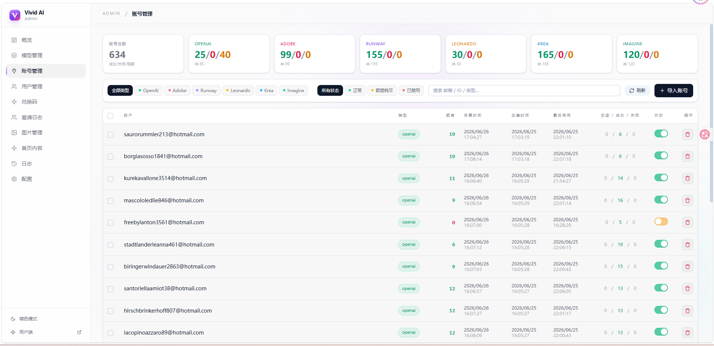

<div align="center">

<h1>image2api</h1>

**多供应商 AI 生图 / 生视频网关 —— 一套 OpenAI 兼容 API,聚合七大平台,开箱即用的运营系统**

<sub>线上实例(品牌):[Vivid AI · vividai.run](https://vividai.run)</sub>

**简体中文** | [English](README.en.md)

[](https://vividai.run)

[](https://go.dev)
[](https://vuejs.org)
[](#-部署)
[](#-openai-兼容-api)
[](#方式一docker-一键推荐)
[](#-支持的模型--供应商)
[](#-部署)
[](#-license)

[在线体验](https://vividai.run) · [功能](#-核心功能) · [部署](#-部署) · [API 文档](#-openai-兼容-api) · [交流群](#-交流--联系)

<br/>


</div>

---

## 📖 目录

- [简介](#-简介)
- [界面预览](#-界面预览)
- [核心功能](#-核心功能)
- [支持的模型 / 供应商](#-支持的模型--供应商)
- [OpenAI 兼容 API](#-openai-兼容-api)
- [部署](#-部署)
- [技术栈](#-技术栈)
- [仓库结构](#-仓库结构)
- [Roadmap](#-roadmap)
- [交流 / 联系](#-交流--联系)
- [License](#-license)

## ✨ 简介

**image2api** 把 Adobe Firefly、OpenAI、Runway、Grok、Leonardo、Krea、Imagine 等平台的图像 / 视频能力,统一封装成**一套 OpenAI 兼容的 API**;背后用多账号池自动调度 —— 额度耗尽自动换号、认证失效自动刷新或判死、临时错误自动重试、token 到期前主动续期 —— 对外提供稳定服务。

它不只是 API 代理:自带**积分计费、CDK 充值、邀请奖励、用户体系、管理后台、现代化画图前端**,一条命令即可跑成一个对外运营的 AI 生成站点 —— 作者的线上实例 **[Vivid AI · vividai.run](https://vividai.run)**(品牌)即基于本项目搭建。

> 💡 前后端**完全开源**(MIT),Go + Vue 3,可自由二开 / 自部署。

**一句话亮点** 🔌 OpenAI 兼容 · 🤖 7 平台十余模型 · 🔁 自动换号 / Token 保活 · 💳 积分 + 代理价计费 · 🎨 画图前端 + 管理后台 · 🐳 一键部署 + 自动 HTTPS

## 🖼️ 界面预览

| 画图台 | 概览看板 |
|:---:|:---:|
|  |  |
| **账号管理** | **日志** |
|  |  |

## 🚀 核心功能

#### 🎨 生成能力
- 生图 + 生视频一站式,支持**图生图 / 参考图**(首帧、末帧、风格参考)
- 多分辨率(1K / 2K / 4K)、多宽高比、视频多时长,按模型独立配置与定价
- 7 大供应商、十余模型,后台**动态启用 / 下架 / 改价**,无需改代码

#### 🔌 OpenAI 兼容
- 文生图 `/v1/images/generations` · 图生图 `/v1/images/edits`(multipart 上传参考图) · 视频 `/v1/videos`(Sora 式异步:创建→轮询→`/content` 下载) · `/v1/models`
- **严格 OpenAI 入参**:`size` 决定比例、`quality` 决定画质档,改个 `base_url` + `api_key` 即接现有 OpenAI SDK
- 图片结果 **base64 直返**,服务端不留存文件,隐私友好

#### 🔁 多账号池 + 智能故障转移
- 账号池轮询调度,单账号出错不影响整体
- **额度耗尽→换号** · **认证失效→刷新重试 / 判死** · **临时错误→同号重试 ×3** · **参数错→直接报错**
- **预扣额度**:生成前原子扣减,失败自动退回,杜绝并发超额

#### 🔐 Token 自动保活
- 一次性轮换 token(Krea / Imagine)**到期前 10 分钟主动续期**,新 token 自动落库
- Adobe cookie 定时换 token;纯 JWT 到期自动判死
- 每日额度按平台重置时间自动恢复 + 重新探测真实余额

#### 💳 计费与运营
- 积分制(**预扣 + 失败退款**),按模型 / 分辨率 / 时长精细定价
- **代理价体系**:用户可设为「代理」角色,模型可设代理价;代理用户(含其 API Key 调用)自动按代理价计费,未设代理价则回退普通价
- **CDK 兑换码**充值 · **邀请奖励** · 邮箱注册 / 验证码 / 找回密码
- 三级角色:普通用户 / 代理 / 管理员(唯一)

#### 🖥️ 用户前台(Vue 3)
- 画图台 · 创作记录画廊 · 生成日志(含失败原因 / 来源标签)
- API 文档 · API Key 管理 · 邀请 · 关于,亮 / 暗主题

#### 🛠️ 管理后台
- 概览看板(趋势 / DAU / 失败 Top / 消费榜)
- 模型管理(普通价 + 代理价) · 账号管理(批量导入 / 去重 / 额度) · 全站日志 · 用户管理(设为代理) · CDK · 展示位 · 站点配置

**🧰 工程亮点**:tls-client(Chrome JA3/JA4 指纹)稳定穿透 Cloudflare · 媒体存 S3/RustFS 经鉴权代理分发 + 保留期清理 · 自愈式维护轮询(恢复额度 / 刷新凭据 / 清理僵死任务并退款) · 一条命令 Docker 部署 + acme.sh 自动 HTTPS。

## 🤖 支持的模型 / 供应商

| 供应商 | 模型(示例) | 类型 |
|---|---|---|
| **Adobe Firefly** | firefly-image-5 · firefly-gpt-image-2 · flux-kontext-max · firefly-video · firefly-ray · gemini-veo31 | 图像 / 视频 |
| **OpenAI** | gpt-image-2 | 图像 |
| **Runway** | runway-gen4-turbo · nano-banana-2(Nano Banana 2) | 视频 / 图像 |
| **Grok（grok.com）** | grok-video（imagine 文生 / 图生视频) | 视频 |
| **Leonardo.ai** | seedream-4.5 | 图像 |
| **Krea.ai** | flux-klein-2 | 图像 |
| **Imagine.art** | imagine-1.5 · imagine-1.5pro | 图像 |

> 模型由管理后台动态启用并定价,可随时增删。

## 🔌 OpenAI 兼容 API

```bash
# 文生图 —— 纯 OpenAI 参数:size→比例,quality→画质档(low/medium/high→1K/2K/4K)
curl https://你的域名/v1/images/generations \
  -H "Authorization: Bearer sk-xxxx" \
  -H "Content-Type: application/json" \
  -d '{
    "model": "gpt-image-2",
    "prompt": "a cute cat on a desk, studio lighting",
    "size": "1024x1024",
    "quality": "high"
  }'

# 图生图 —— multipart 上传参考图(可多张 image[])
curl https://你的域名/v1/images/edits \
  -H "Authorization: Bearer sk-xxxx" \
  -F model="seedream-4.5" -F prompt="改成赛博朋克风格" -F image=@input.png
```

图片返回 OpenAI 风格 `{ "created": ..., "data": [{ "b64_json": "..." }] }`(原始 base64,无 `data:` 前缀,服务端不留存)。**视频**走异步:`POST /v1/videos` 建任务 → 轮询 `GET /v1/videos/{id}` 至 `completed` → `GET /v1/videos/{id}/content` 取 mp4。完整参数见站内 **/docs** 文档页。

## 🚀 部署

前后端均开源。推荐 Docker 一键;也可用 **Go 1.26+** 从源码构建。

> 前置:域名 A 记录指向本机,**80 / 443 对公网开放**(Let's Encrypt 验证需要)。

### 方式一:Docker 一键(推荐)

需要 Docker + Docker Compose。一条命令拉起 Postgres + Redis + RustFS + 后端 + 前端,并**自动签发 / 续期 HTTPS 证书**(内置 acme.sh)。

```bash
cp .env.docker.example .env   # 填 DOMAIN / ACME_EMAIL / POSTGRES_PASSWORD / S3_SECRET_KEY
sh install.sh                 # = docker compose up -d --build
```

打开 `https://<你的域名>/`;证书进度 `docker compose logs -f acme`。`DOMAIN=localhost` 时用自签证书(本地测试)。

<details>
<summary><b>方式二:手动安装</b> — 自建 PostgreSQL / Redis / RustFS / Nginx(点击展开)</summary>

<br/>

自备 **PostgreSQL · Redis · RustFS(或任意 S3)· Nginx**,后端用 **Go 1.26+**,前端用 **Node 18+**。

```bash
# 1. 创建空库(后端启动自动建表)
createdb vivid_ai

# 2. 配置并从源码构建后端
cat > backend/.env <<'EOF'
APP_ENV=production
HTTP_ADDR=127.0.0.1:6666
POSTGRES_DSN=host=127.0.0.1 user=postgres password=你的密码 dbname=vivid_ai port=5432 sslmode=disable TimeZone=Asia/Shanghai
REDIS_ADDR=127.0.0.1:6379
RUSTFS_ENDPOINT=http://127.0.0.1:9000
RUSTFS_BUCKET=vivid-ai
RUSTFS_ACCESS_KEY=你的AK
RUSTFS_SECRET_KEY=你的SK
CORS_ORIGINS=https://你的域名
COOKIE_SECURE=true
EOF
cd backend && go build -o bin/api ./cmd/api && ./bin/api   # 监听 127.0.0.1:6666

# 3. 构建前端(产物 frontend/dist)
cd frontend && npm install && npm run build
```

Nginx 反代(证书自行用 certbot / acme.sh):

```nginx
server {
    listen 443 ssl;
    server_name 你的域名;
    ssl_certificate     /path/fullchain.pem;
    ssl_certificate_key /path/privkey.pem;
    root /path/to/frontend/dist;
    index index.html;
    client_max_body_size 50m;
    proxy_read_timeout 600s;            # 视频生成耗时长

    location /assets/ { expires 1y; add_header Cache-Control "public, max-age=31536000, immutable"; }
    location / { try_files $uri $uri/ /index.html; add_header Cache-Control "no-cache"; }
    location ^~ /admin/api/ { proxy_pass http://127.0.0.1:6666; }
    location ^~ /images/    { proxy_pass http://127.0.0.1:6666; }
    location = /health      { proxy_pass http://127.0.0.1:6666; }
    location ^~ /v1/        { proxy_pass http://127.0.0.1:6666; add_header Cache-Control "no-store" always; }
}
```

> 完整环境变量见 `backend/.env.example`。

</details>

## 🧱 技术栈

| 层 | 技术 |
|---|---|
| 后端 | Go · gin · gorm(PostgreSQL)· go-redis · tls-client(Chrome 指纹) |
| 前端 | Vue 3 · Vue Router · Vite · Tailwind CSS v4 |
| 基础设施 | PostgreSQL · Redis · RustFS(S3 兼容)· Nginx · acme.sh |

## 📦 仓库结构

```
backend/                       后端源码(Go)
├── cmd/
│   ├── api/                   服务入口(main)
│   └── marklabel/             运维小工具(按需标记账号)
├── internal/
│   ├── bootstrap/             应用装配、定时维护任务启动
│   ├── config/                环境变量配置加载
│   ├── http/
│   │   ├── handler/           HTTP 处理器(v1 兼容接口、后台、鉴权…)
│   │   ├── middleware/        鉴权 / 请求 ID 等中间件
│   │   └── router/            路由注册
│   ├── model/                 GORM 数据模型
│   ├── provider/              各上游供应商客户端
│   │   ├── adobe/             Adobe Firefly(tls-client 指纹)
│   │   ├── chatgpt/           OpenAI(含 PoW / turnstile)
│   │   ├── runway/            Runway 视频 + Nano Banana 图像
│   │   ├── grok/              Grok(grok.com,statsig 伪造,视频)
│   │   ├── leonardo/          Leonardo
│   │   ├── krea/              Krea
│   │   └── imagine/           Imagine.art
│   ├── repo/                  数据访问层(用户 / 模型 / 账号 / 日志 / CDK…)
│   ├── service/              业务逻辑(生成调度、计费、账号池、保活、维护)
│   └── storage/               RustFS / S3 媒体存储
├── Dockerfile                 多阶段构建(源码编译 → 精简运行镜像)
└── .env.example               后端环境变量模板

frontend/                      前端源码(Vue 3 + Vite)
├── src/
│   ├── views/                 页面(画图台 / 账号 / 模型 / 日志 / 概览 / 用户…)
│   ├── components/             复用组件(弹窗 / 选择器 / 灯箱…)
│   ├── layouts/                公共 / 后台布局
│   ├── utils/                  工具函数
│   └── api.js · auth.js …      接口封装、鉴权、主题、积分等
├── Dockerfile                 Nginx 静态托管 + 证书监听
└── default.conf.template      Nginx 站点模板(反代 + 缓存策略)

docker-compose.yml             Docker 编排(Postgres / Redis / RustFS / 后端 / 前端 / acme)
install.sh                     一键部署脚本(= docker compose up -d --build)
.env.docker.example            部署环境变量模板
```

## 🗺️ Roadmap

- [ ] 更多上游供应商接入
- [ ] 用量统计 / 导出
- [ ] 多语言界面(i18n)
- [ ] Webhook / 异步回调

## 💬 交流 / 联系

| | |
|---|---|
| 🌐 官网 | **[vividai.run](https://vividai.run)** |
| 👥 QQ 交流群 | **1106849765** · [点击加群](https://qm.qq.com/q/976LeMFoHu) |
| 🐧 QQ | **1114639355** · [加好友](https://qm.qq.com/q/ItgCcNA7ac) |
| 🛒 小店 | **[pay.ldxp.cn/shop/chiyi](https://pay.ldxp.cn/shop/chiyi)** |
| ✉️ 邮箱 | vividairun@gmail.com |

## ⭐ Star History

<!-- 建好 GitHub 仓库后,取消下面这行注释并把 OWNER 换成你的用户名即可显示趋势图: -->
<!-- [](https://star-history.com/#OWNER/image2api&Date) -->

觉得有用就点个 ⭐ 吧 —— 建好仓库后取消上方注释即可展示 Star 趋势图。

## 📄 License

本项目(前端 + 后端)基于 [MIT](LICENSE) 协议开源,可自由使用、修改、商用与二次分发。

<div align="center">

如果这个项目对你有帮助,欢迎 ⭐ Star 支持!

</div>
